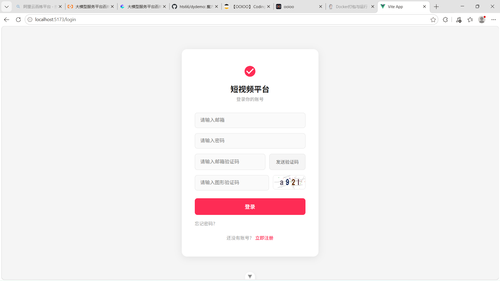
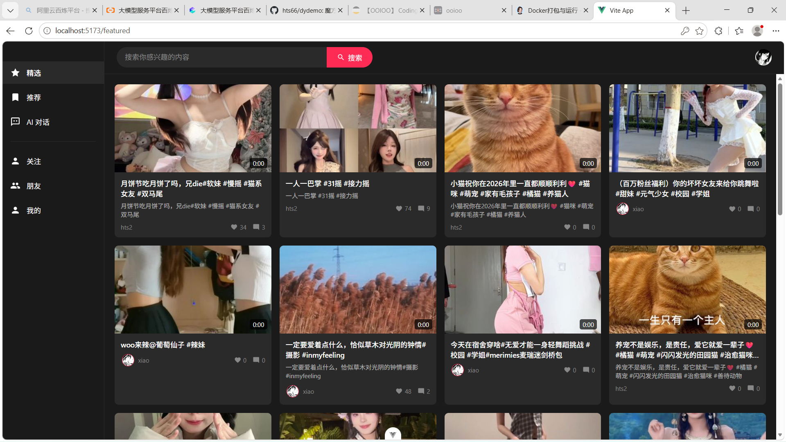
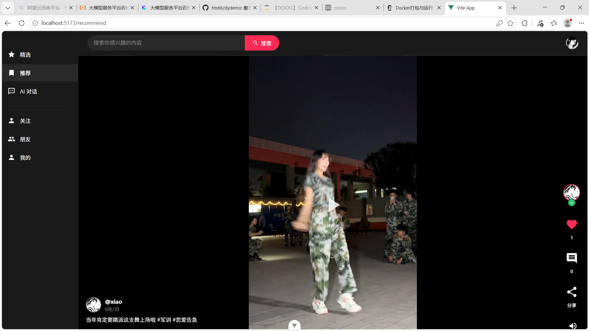
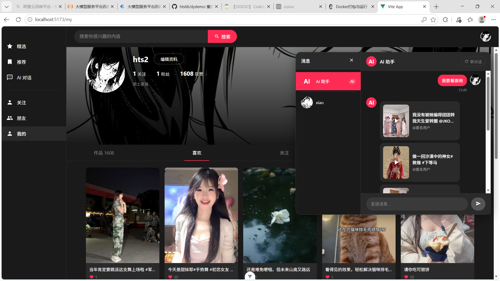
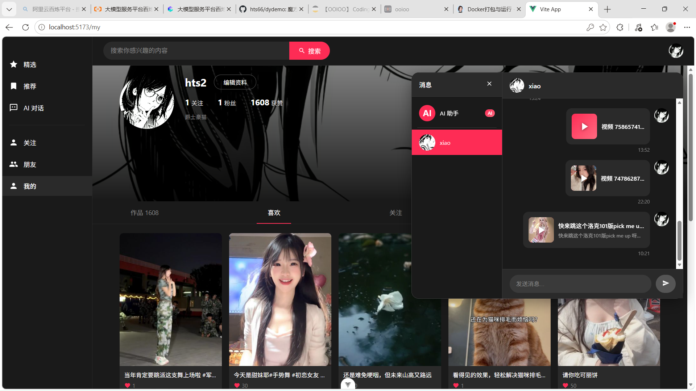

# 短视频平台

一个基于 Vue 3、Spring Boot 和 FastAPI 的全栈短视频平台，支持视频/图片发布、点赞、评论、关注、私信、搜索、热门/推荐流，以及基于 DeepSeek + Qdrant 的 AI 对话与视频推荐。

## 功能特性

- 用户体系：邮箱注册/登录、图形验证码、邮箱验证码、密码找回、JWT 刷新令牌
- 内容发布：视频/图片上传、封面上传、作品发布与删除、本地/MinIO 存储
- 社交互动：点赞、评论、关注、好友、私信、AI 机器人会话
- 内容消费：随机推荐流、热门流、关注流、好友流、关键词搜索、观看历史
- AI 能力：DeepSeek 多轮对话、视频标签向量化、Qdrant 向量检索、AI 视频推荐
- 部署支持：Docker Compose 集成 Qdrant、MinIO、Redis 和 Agent 服务

## 界面截图












## 技术栈

| 模块 | 技术 |
| --- | --- |
| 前端 | Vue 3、Vite、Pinia、Vue Router、Video.js、Axios |
| 后端 | Java 17、Spring Boot 3.5、MyBatis-Plus、Spring Security、JWT、MySQL 8、Redis、MinIO、FFmpeg |
| AI Agent | Python 3.12、FastAPI、LangChain/LangGraph、DeepSeek、Qdrant |
| 基础设施 | Docker Compose、Qdrant、MinIO、Redis |

## 架构

```text
浏览器 / 前端(Vite)
    |
    +---> Spring Boot :8080 ---> MySQL / Redis / MinIO / FFmpeg
    |
    +---> /api/chat/agent ---> FastAPI Agent :8000 ---> DeepSeek / Qdrant
```

前端开发服务器通过 Vite 代理将 `/api` 和 `/uploads` 转发到 `http://localhost:8080`。

## 项目结构

```text
dydemo/
├── dyqianduan/          # Vue 3 前端
├── dyhouduan/           # Spring Boot 后端
├── agent-service/       # FastAPI AI Agent
├── docs/screenshots/    # 项目截图
├── sql/init.sql         # 合并后的数据库初始化脚本
├── biao.sql             # 历史基础表脚本（已合并到 sql/init.sql）
├── update.sql           # 历史升级脚本（已合并到 sql/init.sql）
└── docker-compose.yml   # Qdrant / MinIO / Redis / Agent
```

## 环境要求

- Node.js：`^22.18.0 || >=24.12.0`
- Java 17 与 Maven
- MySQL 8.0+
- Redis 7+
- FFmpeg（视频处理，可配置为系统 PATH 或完整路径）
- Docker Compose（启动 Qdrant、MinIO、Redis、Agent 时使用）

## 快速开始

### 1. 启动基础服务

```bash
docker compose up -d qdrant minio redis
```

如需同时启动 AI Agent：

```bash
docker compose up -d agent-service
```

Agent 依赖 DeepSeek API Key，请先在 `docker-compose.yml` 的 `DEEPSEEK_API_KEY` 或本地 `.env` 中配置。

### 2. 初始化数据库

```bash
mysql -u root -p < sql/init.sql
```

该脚本会创建 `dy` 数据库及以下表：

| 表名 | 说明 |
| --- | --- |
| `users` | 用户、头像、背景、关注/粉丝统计 |
| `works` | 视频/图片作品、点赞/评论/播放统计 |
| `likes` | 点赞关系 |
| `follows` | 关注关系 |
| `comments` | 评论 |
| `watch_history` | 观看历史 |
| `messages` | 私信与 AI 机器人消息 |

`sql/init.sql` 适合全新数据库。如需重建已有库，请先备份数据并手动清库，再执行该脚本。

### 3. 启动后端

```powershell
cd dyhouduan
Copy-Item src/main/resources/application.properties.example src/main/resources/application.properties
```

在 `application.properties` 中填写数据库、Redis、QQ 邮箱 SMTP、JWT、DeepSeek、通义千问视觉模型、Qdrant、MinIO、FFmpeg 等配置，然后运行：

```bash
mvn spring-boot:run
```

后端默认运行在 `http://localhost:8080`。

### 4. 启动 AI Agent（可选）

不使用 Docker 时，可在 `agent-service` 目录本地运行：

```powershell
cd agent-service
python -m venv .venv
.venv\Scripts\Activate.ps1
pip install -r requirements.txt
$env:DEEPSEEK_API_KEY = "你的 DeepSeek API Key"
uvicorn main:app --host 0.0.0.0 --port 8000
```

Agent 默认运行在 `http://localhost:8000`，健康检查地址为 `http://localhost:8000/health`。

### 5. 启动前端

```bash
cd dyqianduan
npm install
npm run dev
```

前端默认运行在 `http://localhost:5173`。生产构建：

```bash
npm run build
npm run preview
```

## 主要接口

| 模块 | 路径 |
| --- | --- |
| 认证与用户 | `/api/auth/*`、`/api/users/*` |
| 作品 | `/api/works/*` |
| 上传 | `/api/upload/*` |
| 点赞 | `/api/likes/*` |
| 评论 | `/api/comments/*` |
| 关注与好友 | `/api/follows/*` |
| 私信 | `/api/messages/*` |
| AI 对话 | `/api/chat/bot`、`/api/chat/agent`、`/api/chat/agent/reset` |
| 视频向量化 | `/api/vector/*` |

## 配置说明

- 后端配置：`dyhouduan/src/main/resources/application.properties.example`
- Agent 配置：根目录 `.env`，或 `docker-compose.yml` 中的 `environment`
- 前端代理：`dyqianduan/vite.config.js`

关键环境变量：

| 变量 | 说明 |
| --- | --- |
| `DEEPSEEK_API_KEY` | DeepSeek API Key |
| `QDRANT_API_KEY` | Qdrant API Key |
| `SPRING_BOOT_API_URL` | Agent 调用 Spring Boot 的地址 |
| `AGENT_PORT` | Agent 服务端口 |

## 常见问题

- MySQL 已在宿主机运行时，`docker-compose.yml` 中的 MySQL 服务默认处于注释状态，请根据本机环境自行选择容器或宿主机 MySQL。
- 若数据库已经按旧脚本初始化，需要补齐 `update.sql` 和 `V1__add_background_column.sql` 中新增的字段；全新环境建议直接使用 `sql/init.sql`。
- MinIO 默认 bucket 为 `dydemo`，如代码未自动创建，可在 MinIO 控制台手动创建。
